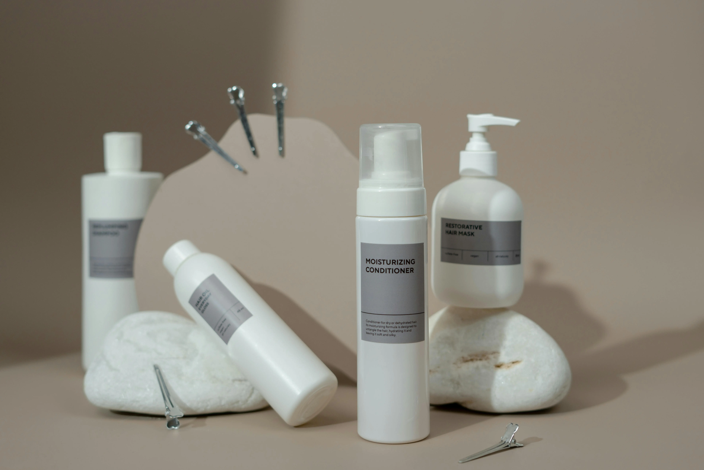

# 🛍️ Luméa Beauty — Online Cosmetics Store

A stylish and minimalist online cosmetics shop built with **React 19**, focused on **usability**, **performance**, and **clean code architecture**.

---

## ✨ Features

- 📦 **Dynamic Product Listing**  
  Fetches real product data in real-time via DummyJSON API.

- 🛒 **Individual Product Pages**  
  Dynamic routing for viewing detailed product information.

- 🔍 **Performance Optimized**  
  Lazy loading and suspense used for faster UX.

- 🎨 **Modern SCSS Styling**  
  Pastel & beige tones with modular, maintainable styles.

- 🚚 **Dedicated Static Pages**  
  Contacts, Delivery Information, and Custom 404 Page.

- 💄 **Minimalistic UI/UX**  
  Designed with attention to detail for beauty and accessibility.

---

## 🧱 Stack

- ⚛️ React 19  
- 🔁 React Router  
- 🎣 Custom `useFetch` hook  
- 💅 SCSS Modules  
- 💡 Semantic HTML  
- 🌀 Animated SVG Loader  
- 🔗 DummyJSON API for fake backend

---

## 📁 Folder Structure

<pre>
src
├── App.jsx
├── App.scss
├── api
│   └── apiRoutes.js
├── assets
│   ├── img
│   │   ├── contacts/
│   │   ├── delivery/
│   │   ├── home/
│   │   ├── page404/
│   │   └── shop/
│   └── styles
│       ├── base/
│       ├── components/
│       └── layout/
├── components
│   ├── Footer.jsx
│   ├── Header.jsx
│   ├── Hero.jsx
│   ├── Layout.jsx
│   ├── NavBar.jsx
│   ├── Spinner.jsx
│   └── utils.js
├── hooks
│   └── useFetch.js
├── pages
│   ├── contacts/
│   ├── delivery/
│   ├── home/
│   ├── page404/
│   └── shop/
│       ├── products/
├── routes
│   ├── AppRoutes.jsx
│   └── frontRoutes.js
└── main.jsx
</pre>

---

## 📌 Notes

This is a **study project** created to dive deep into:
- SPA routing and navigation
- Lazy loading with suspense boundaries
- Modular styling with SCSS
- Real-world folder architecture for scalable React apps

API data comes from [DummyJSON](https://dummyjson.com) to simulate backend interactions without server setup.

---

## 🖼️ UI Style Highlights

- 🎨 Pastel colors with elegant, feminine branding
- 🧼 Clean layout focused on ease of navigation
- 📱 Fully responsive across all devices
